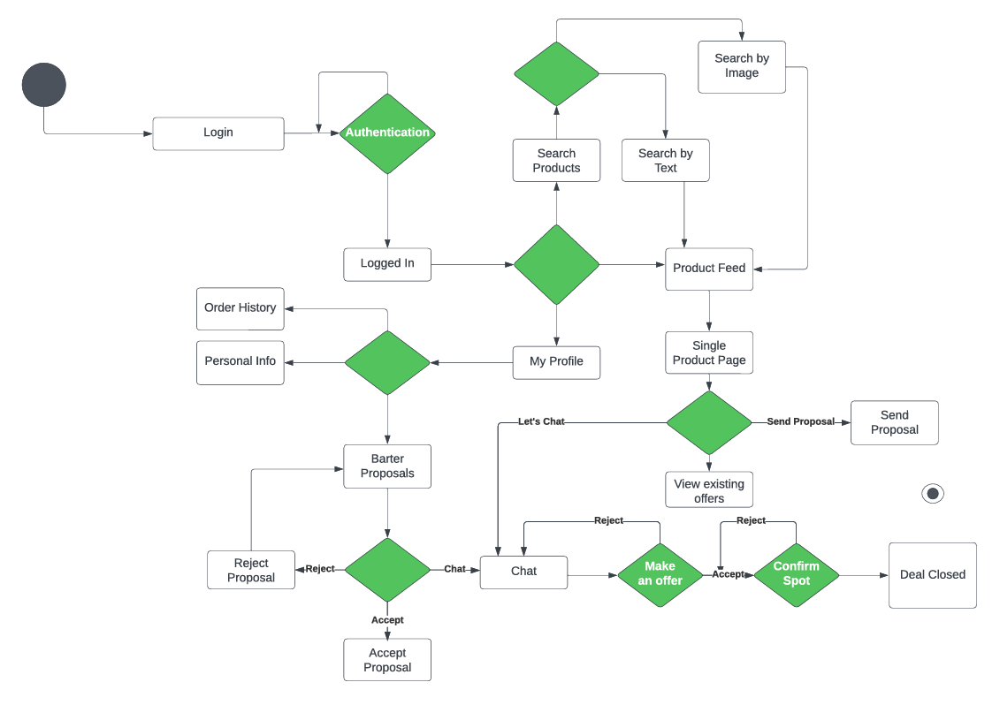
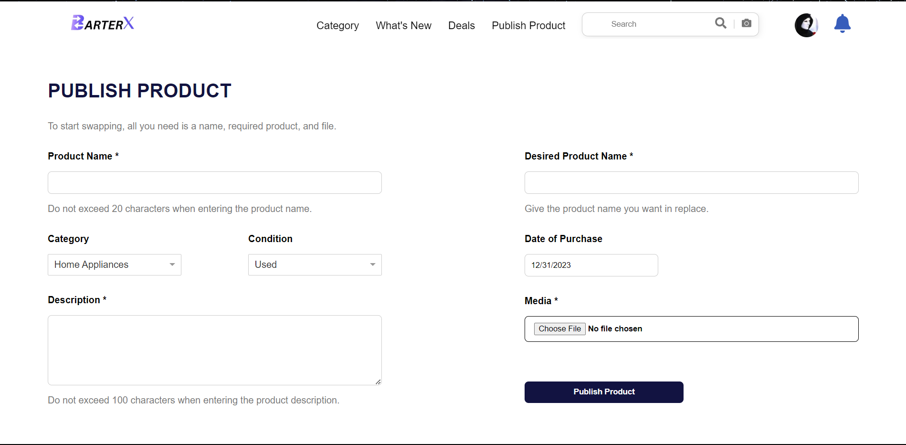

# BarterX

<br/>
<p align="center">
  <a href="https://github.com/MohibSayed/BarterX">
    
  </a>

  <h3 align="center">BarterX</h3>

  <p align="center">
    "Innovating Exchange, Igniting Trade"
    <br/>
    <br/>
    <a href="https://github.com/MohibSayed/BarterX"><strong>Explore the docs »</strong></a>
    <br/>
    <br/>
    <a href="https://github.com/MohibSayed/BarterX">Architecture</a>
    .
    <a href="https://github.com/MohibSayed/BarterX/issues">Features</a>
    .
    <a href="https://github.com/MohibSayed/BarterX/issues">Local Setup</a>
  </p>
</p>


https://github.com/MohibSayed/BarterX/assets/95119784/f2e57a56-982c-47c6-b9b9-cf0257d4c0d9

## Table Of Contents

- [About the Project](#about-the-project)
- [Architecture](#built-with)
- [Demonstration & Features](#usage)
- [Technologies Used](#roadmap)
- [Contributing](#contributing)
- [License](#license)
- [Authors](#authors)

## About The Project

Traditional commerce lacks sustainable alternatives, leading to excessive unnecessary consumption and waste. Our society needs an innovative and sustainable solution/platform to empower individuals to exchange goods or items, promoting a more eco-friendly, community-oriented, conscious and responsible lifestyle.

Objectives:

- The primary objective of BarterX is to provide a user-friendly platform that facilitates meaningful exchanges of goods and services.
- Encourage users to swap items they no longer need, promoting a culture of sustainability and reducing unnecessary waste.
- Encourage regular engagement through features like one to one chats, and user proposals.
- Who says you need to know all the trends by name to shop? If you see something you like, take a picture, upload and start trading.


Of course, no one template will serve all projects since your needs may be different. So I'll be adding more in the near future. You may also suggest changes by forking this repo and creating a pull request or opening an issue.

A list of commonly used resources that I find helpful are listed in the acknowledgements.

## Architecture

The architecture and workflow was built using smartdraw.



## Demonstration & Features


(image-1.png)
(image-2.png)
(image-3.png)
(image-4.png)


(image-6.png)
(image-7.png)

(image-10.png)
(image-9.png)




### Technologies Used

- Workflow and Architecture Design
  - SmartDraw
- Frontend
  - React.js
  - CSS
- Backend
  - Node.js (Express.js)
  - MongoDB
- Machine Learning
  - pickle
  - Tensorflow_hub
  - Flask
  - sklearn


<br />

## Contributing

**Local Setup || Project Structure**

NOTE: Individual instructions can be found in respective directories.

- The project contains 4 broad directories.

```
*
├───client
├───extension
├───model
└───server
```

- `client`: The frontend for the application.
- `extension`: Chrome/Edge extension to keep a track of browser tabs.
- `model`: Model APIs for Machine Learning.
- `server`: The backend for the application.

<br />

**Client**

For local setup of frontend:
- `cd client`
- `npm i`
- `npm start`
- Go to `localhost:3000`

Structure

```
src
├───assets
├───components
├───containers
└───index.js
```

Individual Component & Container Structure

```
component
├───component.jsx
└───component.css
```

<br />
<br />


## License

Distributed under the MIT License. See [LICENSE](https://github.com/MohibSayed/BarterX/blob/main/LICENSE.md) for more information.

## Authors

- Om Shete
  - [LinkedIn](https://www.linkedin.com/in/om-shete-25748522a/)
- Mohib Abbas Sayed
  - [LinkedIn](https://www.linkedin.com/in/mohib-abbas-sayed-83837422a/?utm_source=share&utm_campaign=share_via&utm_content=profile&utm_medium=android_app)
- Hamza Sayyed
  - [Twitter](https://shorturl.at/hjAEI) 

Profiles of my Team


